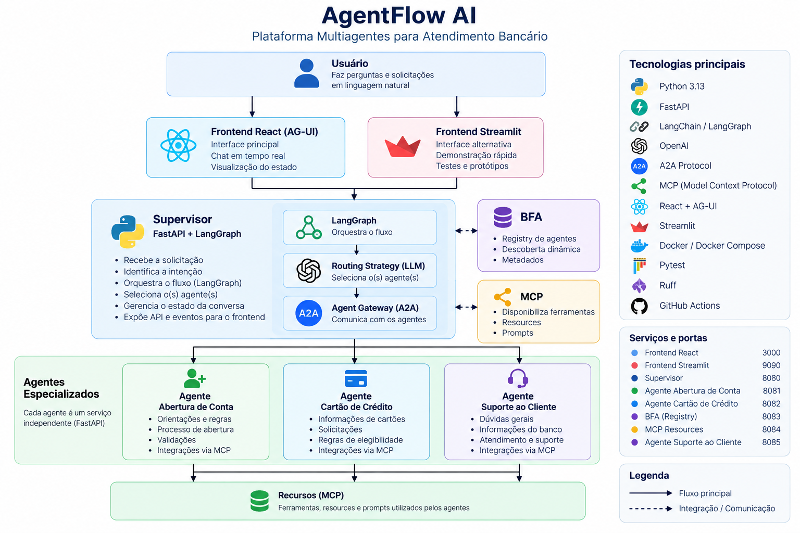
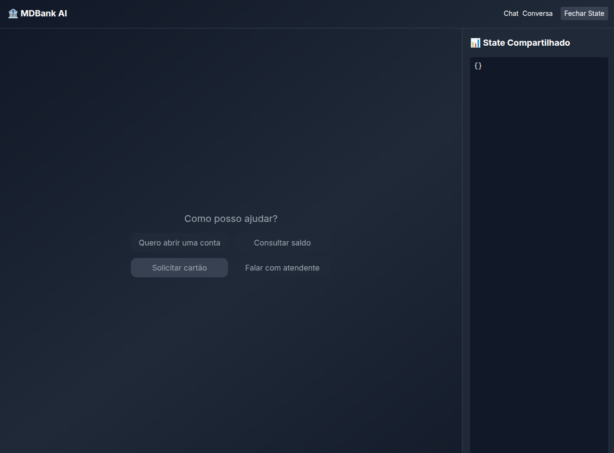
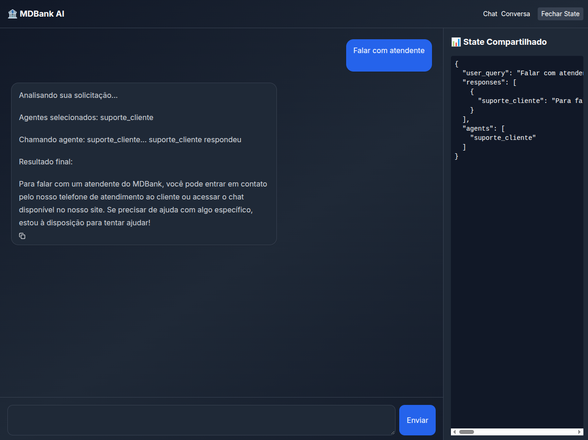

# AgentFlow AI

[](https://github.com/diegoportela-dev/Agentflow-ai/actions/workflows/ci.yml)

Plataforma multiagentes para atendimento bancário construída com Python, FastAPI, LangGraph, protocolo A2A e MCP.

O projeto demonstra uma arquitetura distribuída em que um supervisor identifica a intenção do usuário e encaminha a solicitação para agentes especializados.

Atualmente, o sistema possui agentes para:

- abertura de conta;
- cartão de crédito;
- suporte ao cliente.

Além da interface principal em React, o projeto possui uma interface alternativa em Streamlit para demonstração.

---

## Arquitetura

O fluxo principal da aplicação é:



O supervisor utiliza LangGraph para orquestrar o fluxo e selecionar um ou mais agentes de acordo com a intenção identificada.

---

## Demonstração

### Interface principal

A interface React utiliza AG-UI para interação com o sistema multiagentes e permite iniciar diferentes fluxos de atendimento.

<p align="center">
  
</p>

### Roteamento multiagente

Neste exemplo, o usuário solicita atendimento ao suporte. O supervisor analisa a intenção, seleciona o agente suporte_cliente e encaminha a solicitação por meio do protocolo A2A.

O estado compartilhado permite acompanhar em tempo real a solicitação do usuário, os agentes selecionados e as respostas retornadas durante a execução.

<p align="center">
  
</p>

---

## Principais tecnologias

### Backend

- Python 3.13
- FastAPI
- Starlette
- LangChain
- LangGraph
- OpenAI
- A2A Protocol
- FastMCP

### Frontend

- React
- JavaScript
- AG-UI
- Streamlit

### Infraestrutura e qualidade

- Docker
- Docker Compose
- Pytest
- Ruff
- GitHub Actions

---

## Agentes

### Abertura de Conta

Responsável por solicitações relacionadas à abertura de contas bancárias.

Exemplos:

```text
Quero abrir uma conta.
Como faço para criar uma conta?
Quero abrir uma conta digital.
```

### Cartão de Crédito

Responsável por solicitações e dúvidas relacionadas aos cartões do banco.

Exemplos:

```text
Quero solicitar um cartão.
Quais cartões estão disponíveis?
Quero um cartão Platinum.
```

### Suporte ao Cliente

Responsável por dúvidas gerais e solicitações que não pertencem diretamente aos demais agentes.

Exemplos:

```text
Preciso de ajuda.
Quero falar com o suporte.
Quais serviços o MDBank oferece?
```

---

## Arquitetura do Supervisor

O supervisor foi organizado em camadas inspiradas nos princípios da Clean Architecture, buscando separar regras de negócio, casos de uso, infraestrutura e apresentação.

```text
supervisor/src/

├── domain/
│   ├── agent_gateway.py
│   └── agent_routing_strategy.py
│
├── application/
│   ├── supervisor_service.py
│   └── supervisor_graph.py
│
├── infrastructure/
│   ├── a2a_agent_gateway.py
│   ├── dependencies.py
│   ├── llm_routing_strategy.py
│   └── settings.py
│
├── presentation/
│   └── agui_stream.py
│
├── agents.py
├── schemas.py
└── services.py
```

### Domain

Contém contratos independentes dos detalhes de infraestrutura.

Principais contratos:

- `AgentGateway`
- `AgentRoutingStrategy`

Esses contratos permitem que a camada de aplicação utilize abstrações sem conhecer diretamente detalhes como A2A ou OpenAI.

### Application

Contém a lógica de orquestração da aplicação.

Principais componentes:

- `SupervisorService`
- `supervisor_graph`

O `SupervisorService` coordena o roteamento e a execução dos agentes.

O `supervisor_graph` é responsável pela construção do fluxo utilizando LangGraph.

### Infrastructure

Contém implementações relacionadas a tecnologias externas.

Entre elas:

- comunicação utilizando A2A;
- estratégia de roteamento utilizando LLM;
- configuração da aplicação;
- criação e injeção das dependências.

### Presentation

Responsável pela comunicação entre o supervisor e a interface AG-UI.

Essa camada também controla o streaming dos eventos enviados para o frontend.

---

## Fluxo de uma solicitação

Quando o usuário envia uma mensagem, o fluxo simplificado é:

```text
1. Usuário envia uma mensagem
             |
             v
2. Supervisor recebe a solicitação
             |
             v
3. Routing Strategy analisa a intenção
             |
             v
4. Um ou mais agentes são selecionados
             |
             v
5. Supervisor executa os agentes
             |
             v
6. Comunicação ocorre através do A2A
             |
             v
7. Agentes podem utilizar recursos MCP
             |
             v
8. Resposta retorna ao supervisor
             |
             v
9. AG-UI envia eventos para o frontend
             |
             v
10. Usuário recebe a resposta
```

---

## Princípios de engenharia

O projeto busca aplicar princípios de SOLID, Clean Code e separação de responsabilidades.

### SRP — Single Responsibility Principle

As responsabilidades foram separadas em componentes específicos.

Por exemplo:

- `SupervisorService` → orquestra os casos de uso;
- `AgentRoutingStrategy` → define o contrato de roteamento;
- `A2AAgentGateway` → realiza comunicação com agentes;
- `supervisor_graph` → define o fluxo LangGraph;
- `agui_stream` → trata eventos de apresentação.

Isso reduz o acoplamento e evita concentrar diferentes responsabilidades em uma única classe ou módulo.

### DIP — Dependency Inversion Principle

A camada de aplicação depende de abstrações:

```python
AgentGateway
AgentRoutingStrategy
```

em vez de depender diretamente de implementações específicas como:

```python
A2AAgentGateway
LLMRoutingStrategy
```

Isso facilita substituições e testes.

---

## Design Patterns

### Strategy Pattern

O roteamento dos agentes utiliza uma abstração:

```python
AgentRoutingStrategy
```

A implementação utilizada atualmente é:

```python
LLMRoutingStrategy
```

Dessa forma, seria possível criar outras estratégias futuramente sem alterar o `SupervisorService`.

Por exemplo:

```text
AgentRoutingStrategy
        |
        +---- LLMRoutingStrategy
        |
        +---- RuleBasedRoutingStrategy
        |
        +---- HybridRoutingStrategy
```

---

### Gateway / Adapter

A comunicação externa com os agentes é encapsulada através do:

```python
AgentGateway
```

com implementação:

```python
A2AAgentGateway
```

Assim, o `SupervisorService` não precisa conhecer os detalhes do protocolo A2A.

---

### Dependency Injection

O `SupervisorService` recebe suas dependências externamente.

Conceitualmente:

```python
SupervisorService(
    agent_gateway=agent_gateway,
    routing_strategy=routing_strategy,
)
```

Isso permite substituir dependências reais por implementações fake durante os testes.

---

## Protocolo A2A

Os agentes especializados são serviços independentes.

A comunicação entre o supervisor e esses agentes utiliza o protocolo A2A.

Atualmente existem três agentes:

```text
Supervisor
    |
    | A2A
    |
    +----> abrir_conta_agent
    |
    +----> cartao_credito_agent
    |
    +----> suporte_cliente_agent
```

Cada agente possui seu próprio:

- Dockerfile;
- servidor;
- executor;
- configuração;
- dependências.

Essa abordagem permite que os agentes sejam desenvolvidos e executados de maneira independente.

---

## MCP

O projeto também utiliza MCP para disponibilizar recursos e ferramentas aos agentes.

O serviço `recursos` possui funcionalidades relacionadas a:

```text
consultar_conta
consultar_cartao
criar_ou_buscar_conta
solicitar_cartao
```

Além de resources relacionados a:

```text
obter_conta
obter_cartao
```

e prompts especializados para operações bancárias.

O fluxo conceitual é:

```text
Agente
   |
   v
MCP
   |
   +---- Tools
   |
   +---- Resources
   |
   +---- Prompts
```

---

## State compartilhado

A interface React utilizando AG-UI permite visualizar o estado compartilhado durante a execução.

Exemplo:

```json
{
  "user_query": "Quero falar com o suporte",
  "agents": [
    "suporte_cliente"
  ],
  "responses": [
    {
      "suporte_cliente": "Resposta do agente"
    }
  ]
}
```

Isso facilita a visualização do processo de orquestração dos agentes.

---

## Memória e isolamento de sessões

O sistema mantém o contexto das conversas utilizando `thread_id`.

Cada sessão do frontend possui um identificador próprio, permitindo que o
supervisor e os agentes especializados mantenham o contexto correto da
conversa sem compartilhar memória entre usuários ou sessões diferentes.

O `thread_id` é propagado durante o fluxo:

```text
React
  |
  | thread_id
  v
Supervisor
  |
  | thread_id
  v
A2A Gateway
  |
  | metadata
  v
Agente especializado
  |
  v
LangGraph Checkpointer
```

Isso permite manter informações contextuais da conversa, como o assunto
tratado anteriormente, sem utilizar um identificador global compartilhado
entre todas as sessões.

Exemplo:

```text
Sessão A -> thread_id: abc-123
Sessão B -> thread_id: xyz-789
```

As duas conversas possuem memórias independentes.

---

## Testes

Os testes automatizados utilizam `pytest`.

A arquitetura permite utilizar implementações fake para evitar chamadas reais para:

- OpenAI;
- APIs HTTP;
- agentes A2A.

Para executar:

```bash
docker compose exec supervisor pytest -v
```

Os testes cobrem componentes como:

```text
AgentGateway
AgentRoutingStrategy
SupervisorService
SupervisorGraph
```

---

## Qualidade de código

O projeto utiliza Ruff para análise estática e padronização do código Python.

Execute:

```bash
docker compose exec supervisor ruff check src tests
```

A configuração está localizada em:

```text
supervisor/pyproject.toml
```

---

## Integração Contínua

O projeto utiliza GitHub Actions para executar verificações automaticamente.

A pipeline está definida em:

```text
.github/workflows/ci.yml
```

O fluxo de CI executa verificações como:

```text
Push / Pull Request
        |
        v
GitHub Actions
        |
        v
Instalação das dependências
        |
        v
Ruff
        |
        v
Pytest
        |
        v
Build aprovado
```

Isso ajuda a impedir que alterações com problemas de qualidade ou testes quebrados sejam integradas sem validação.

---

## Executando o projeto

### 1. Clone o repositório

```bash
git clone https://github.com/diegoportela-dev/AgentFlow-ai.git
cd AgentFlow-ai
```

### 2. Configure as variáveis de ambiente

Utilize o arquivo:

```text
.env.example
```

como referência.

Exemplo:

```env
OPENAI_API_KEY=
OPENAI_MODEL=

CARTAO_CREDITO_AGENT_URL=http://cartao_credito_agent:8000
ABRIR_CONTA_AGENT_URL=http://abrir_conta_agent:8000
SUPORTE_CLIENTE_AGENT_URL=http://suporte_cliente_agent:8000
```

> Nunca versione chaves de API reais no repositório.

### 3. Suba os containers

```bash
docker compose up --build
```

Ou em background:

```bash
docker compose up -d --build
```

### 4. Verifique os serviços

```bash
docker compose ps
```

---

## Serviços

| Serviço | Porta |
|---|---:|
| Supervisor | 8080 |
| Agente de abertura de conta | 8081 |
| Agente de cartão de crédito | 8082 |
| BFA | 8083 |
| MCP Resources | 8084 |
| Agente de suporte | 8085 |
| React | 3000 |
| Streamlit | 9090 |

---

## Healthchecks

Os principais serviços possuem healthchecks configurados no Docker Compose.

Os serviços HTTP disponibilizam:

```text
GET /health
```

O serviço FastMCP utiliza uma verificação de disponibilidade TCP.

Isso permite que o Docker Compose identifique quando os serviços estão prontos antes de inicializar componentes dependentes.

---

## Estrutura geral

```text
agentflow-ai/

├── agents/
│   ├── abrir_conta/
│   ├── cartao_credito/
│   └── suporte_cliente/
│
├── bfa/
│
├── frontend-react/
│
├── frontend-streamlit/
│
├── recursos/
│
├── supervisor/
│   ├── src/
│   │   ├── application/
│   │   ├── domain/
│   │   ├── infrastructure/
│   │   └── presentation/
│   │
│   └── tests/
│
├── .github/
│   └── workflows/
│       └── ci.yml
│
├── docker-compose.yml
├── .env.example
└── README.md
```

---

## Status do projeto

Principais funcionalidades implementadas:

- [x] Arquitetura multiagentes
- [x] Supervisor
- [x] LangGraph
- [x] Roteamento utilizando LLM
- [x] Agente de abertura de conta
- [x] Agente de cartão de crédito
- [x] Agente de suporte ao cliente
- [x] Comunicação utilizando A2A
- [x] MCP
- [x] Resources MCP
- [x] Tools MCP
- [x] React
- [x] AG-UI
- [x] State compartilhado
- [x] Streamlit
- [x] Docker
- [x] Docker Compose
- [x] Healthchecks
- [x] Testes automatizados
- [x] Ruff
- [x] GitHub Actions / CI
- [x] Memória contextual por sessão
- [x] Isolamento de conversas utilizando thread_id

---

## Objetivo do projeto

O AgentFlow AI foi desenvolvido como projeto de estudo e portfólio com o objetivo de explorar conceitos modernos de desenvolvimento de aplicações baseadas em Inteligência Artificial.

Entre os principais conceitos estudados estão:

- arquiteturas multiagentes;
- orquestração de agentes;
- LangGraph;
- comunicação A2A;
- Model Context Protocol (MCP);
- AG-UI;
- Clean Architecture;
- SOLID;
- Design Patterns;
- Dependency Injection;
- testes automatizados;
- containers;
- integração contínua.

O foco não está apenas na utilização de modelos de linguagem, mas também na aplicação de boas práticas de engenharia de software para construir uma solução modular, testável e extensível.